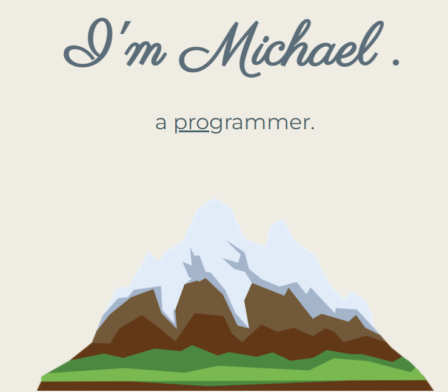

# Portfolio Website

## Description

As an aspiring web developer, I wanted a website created by me to showcase the skills and organizational skills learned throughtout my schooling and how I can apply them. By creating the application, I can share my repo with future employers to evaluate my skillset and see my personal progression through the bootcamp. 

The portfolio website will be a direct link to what I can do as an aspiring web developer and can be used to judge my knowledge at different intervals during the bootcamp. This project has allowed me to learn different ways to produced website responsiveness while creating a simple, clean design. 

With more changes to come, I am looking forward to making changes to create an even more beautiful website.

## Website Showcase

### <ins>[Portfolio](https://tiomeko.github.io/portfolio-website/)</ins>

